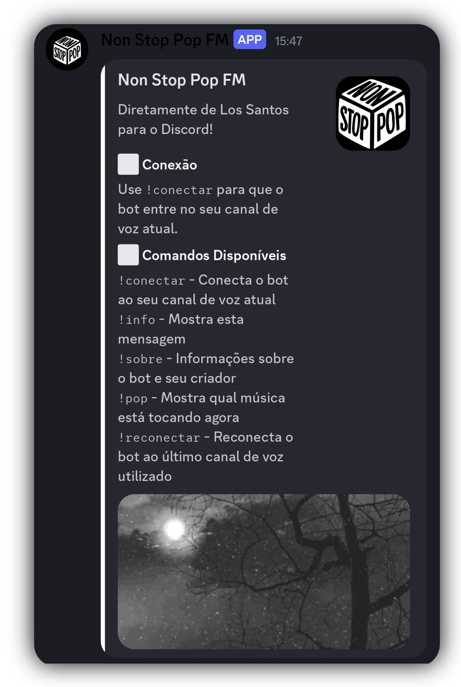
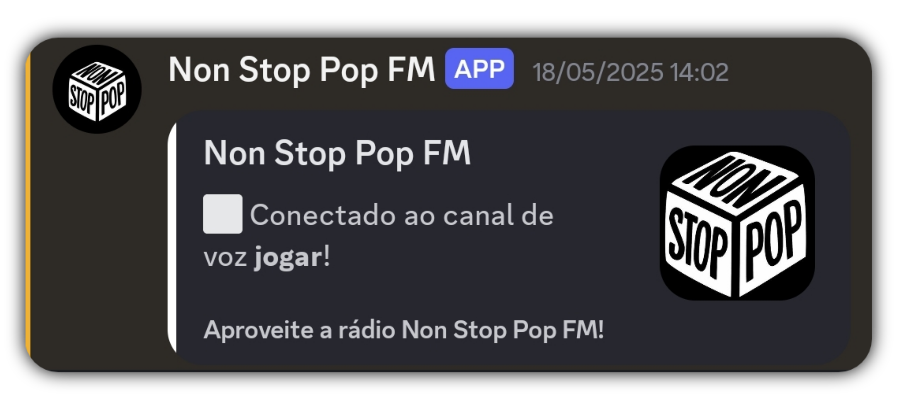
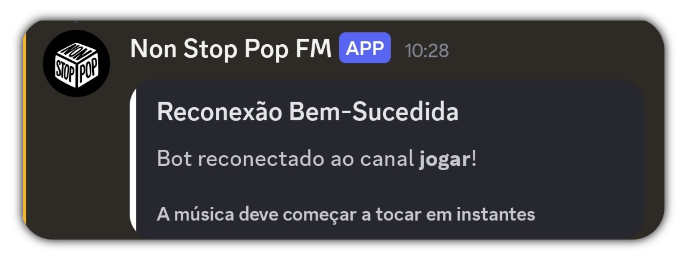
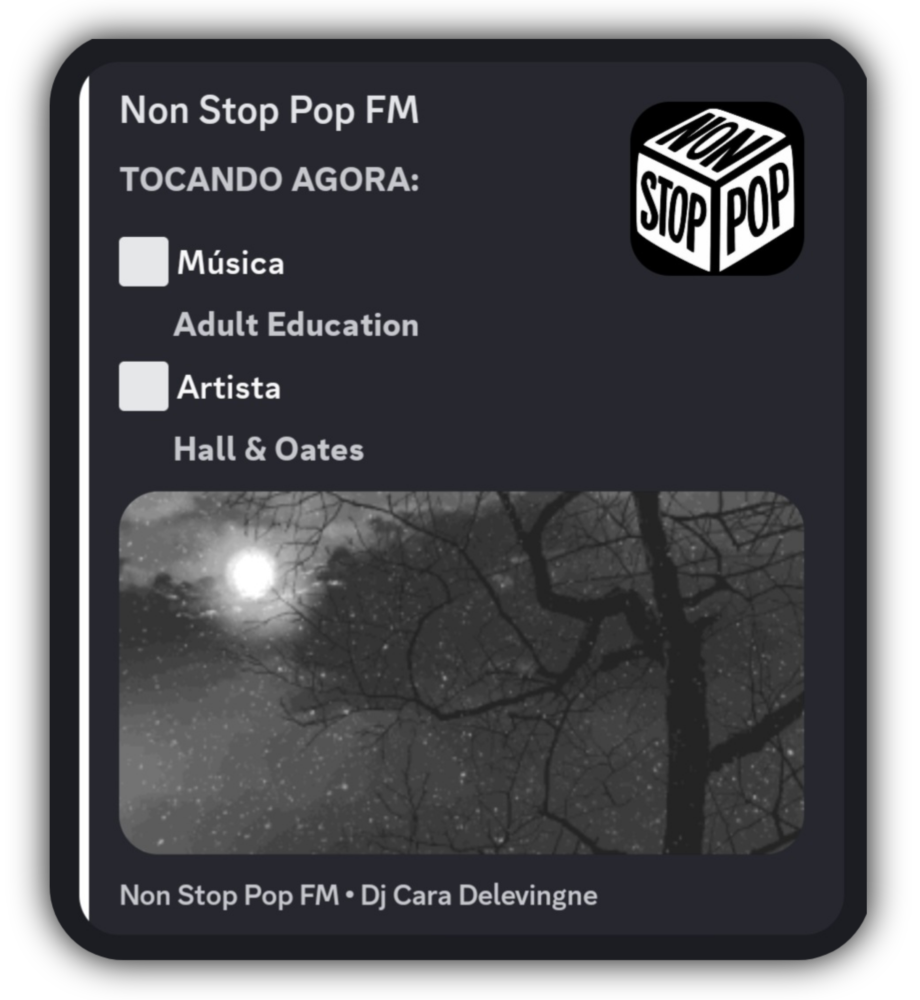

 
<h1 align="center">Non Stop Pop FM</h1>

<!-- about me -->
 <h3 align="left">Bot Discord Da Non Stop Pop FM 24/7</h3>

Este é um projeto de bot desenvolvido para tocar músicas no Discord com foco em pop internacional. Inspirado na rádio Non-Stop Pop FM do GTA V, o bot foi criado usando Node.js e a biblioteca Discord.js, com o objetivo de oferecer uma experiência musical contínua, divertida e nostálgica para os usuários de servidores no Discord.

 

<h3>Utilizado no Projeto</h3>

 

</h4>

 

##  Topicos

- [Comandos do Bot](#comandos)
  - [Respostas Do Bot](#respostas)
- [Tecnologias Utilizadas](#tecnologias)
- [Contato](#Contato)

<h2 id="comandos">
   Comandos do Bot
</h2>

**Esse Bot possui os seguintes comandos:**

`!info` - Mostra todos os comandos do bot.

`!conectar` - Conectar o bot ao canal de voz atual do usuário.

`!reconectar` - Se o bot cair. use esse comando e ele irá retornar para o canal de voz que ele foi adicionado anteriormente. 

`!pop` - Mostrar qual é a musica que está tocando agora no bot.

`!sobre` - Mostra informações sobre o bot, as informações até o momento são: **Desenvolvedor do bot** e **Link do github do desenvolvedor**. 

 
O bot até o momento só possui esses comandos, outros comandos só serão adicionados se forem uma adição que não vá muito além da ideia de ser uma "radio".
 
 
 

<h3 id="respostas" align="center">
   Respostas do Bot
</h3>

<!-- Conectar  -->

 

`!conectar`
 

O bot irá conectar ao canal de voz atual do usário, caso o usuário não tiver em um canal de voz, bot irá retornar uma mensagem pedindo que o usuário esteja em um canal de voz ao para executar o comando.
 
 

 

<!-- Reconectar  -->

 

 

`!reconectar`
 

O bot irá reconectar ao canal de voz que ele se conectou anteriormente.
 
 

 

<!-- pop  -->

 

 

`!pop`
 

O bot irá responder com o nome da música que está tocando no momento e o nome do artista dono da música. 

Caso nenhuma música esteja tocando, o bot irá responder que não tem nenhuma música tocando naquele momento. 

Todas as melhores músicas da rádio estão presentes nesse bot:

`Lady - Modjo`
`1 Thing - Amerie`
`Gimme More - Britney Spears`
`Feel Good Inc. - Gorillaz`
`Moves Like Jagger - Maroon 5`
`Bad Girls - M.I.A.`

E muitas outras.
 
 
 

<h2 id="tecnologias">
   Tecnologias Utilizadas
</h2>

 

<h2 id="Contato" align="center">
   Contato
</h2>

<!-- minhas redes  --> 
  
 

  ﾠ
  ﾠ
  

  

   

